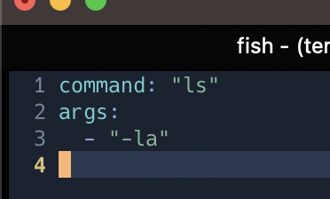

# nvc

open nvim config with neovim

# install

```
$ go install github.com/kaepa3/nvc@latest
```

# command

add the below command

```
$nvc
```

# config

can change command and args
confing file is **~/.nvc.yaml**

default command is nvim
default args is "~/.config/nvim"
